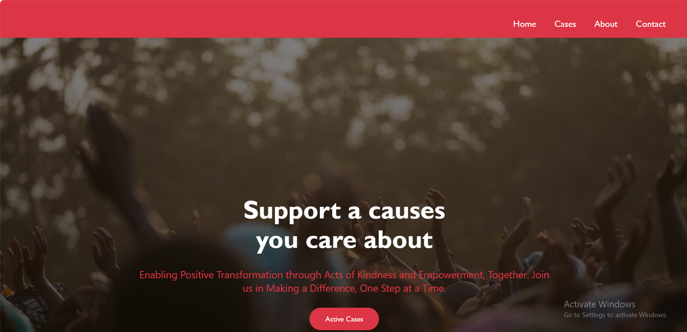
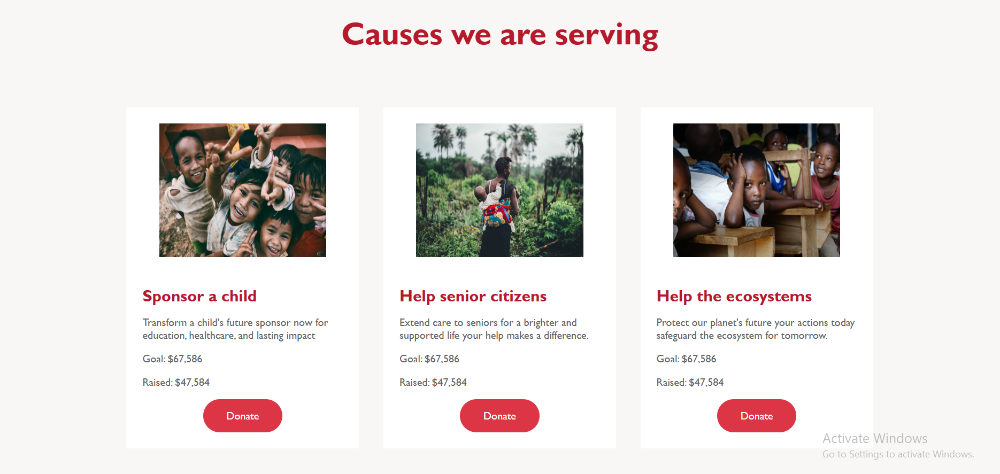
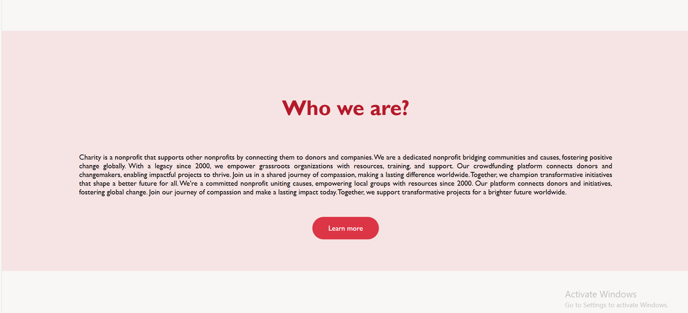
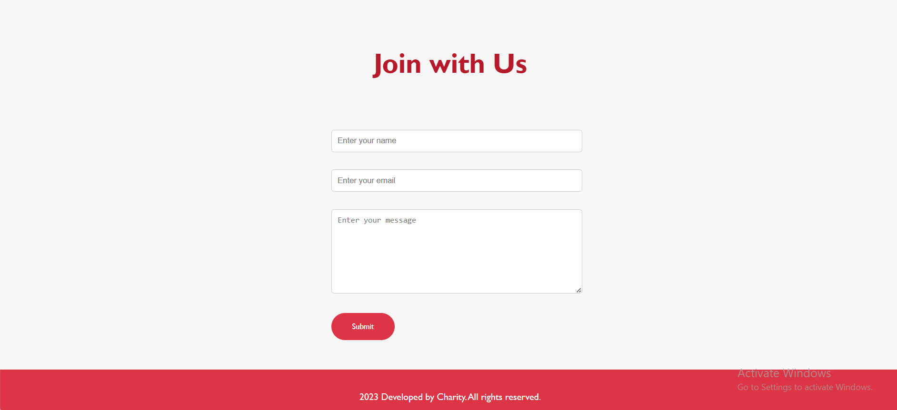

    🌟 Project Title: Charitor – Charity Support Web Application 🌟

**📖 About the Project**

Charitor is a simple, elegant, and responsive charity support web application aimed at encouraging users to explore various active causes and support them. The application highlights multiple charitable campaigns and provides an option for users to connect and contribute.
The project serves as a static frontend prototype for a donation platform, promoting social impact causes such as child education, senior citizen welfare, and ecosystem preservation.

**🔧 Technologies Used**

• HTML5 – for structuring the content

• CSS3 – for styling and layout

• JavaScript – for basic form validation

**📸 Screenshots**

